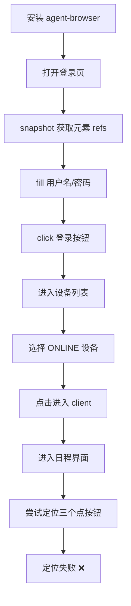

# agent-browser AX Tree 定位策略测试报告     UI测试

## 一、调研总结

### 1.1 技术方案背景

基于 `test.md` 可行性研究报告，确定采用 **"AX Tree 优先、视觉回退"** 的混合策略进行 UI 自动化测试。核心工作流为：

```
snapshot → ref → act → re-snapshot
```

### 1.2 工具选型

| 工具 | 说明 | 优势 |
|------|------|------|
| agent-browser | Vercel 开源的 headless browser CLI | 低 token、确定性执行、daemon 常驻 |
| OpenClaw | 替代方案，支持 `--labels` 截图 | 视觉回退能力更强 |

### 1.3 agent-browser 核心命令

```bash
# 导航
agent-browser open <url>

# 获取快照（关键）
agent-browser snapshot -i          # 交互元素 + refs
agent-browser snapshot -i -C       # 包含 cursor:pointer 元素

# 交互
agent-browser click @e1
agent-browser fill @e2 "text"

# 等待
agent-browser wait --load networkidle
```

---

## 二、测试执行记录

### 2.1 测试环境

| 项目 | 值 |
|------|-----|
| 目标系统 | cocowa robot-client |
| URL | http://192.168.10.234/robot-client/ |
| 账号 | test_user / test123 |
| 测试用例范围 | chat-001 ~ chat-010 |

### 2.2 测试流程



### 2.3 成功执行的步骤

| 步骤 | 命令 | 结果 |
|------|------|------|
| 安装工具 | `npm install -g agent-browser` | ✅ 成功 |
| 打开页面 | `agent-browser open <url>` | ✅ 跳转到登录页 |
| 获取快照 | `agent-browser snapshot -i` | ✅ 获取到 e1~e3 (用户名/密码/登录) |
| 登录 | `fill @e1` + `fill @e2` + `click @e3` | ✅ 登录成功 |
| 选择设备 | `click @e10` (PC001 ONLINE) | ✅ 设备选中 |
| 进入 client | `click @e235` (进入client) | ✅ 进入日程界面 |

### 2.4 失败的步骤

| 用例 | 目标 | 问题 |
|------|------|------|
| chat-001 | 点击聊天界面右上角"三个点"按钮 | **定位失败** |

---

## 三、问题分析

### 3.1 核心问题：元素定位失败

**现象**：聊天界面右上角的"..."三个点按钮在 AX Tree 快照中**没有被正确识别**。

**snapshot 输出**：
```
- button [ref=e1]              # 用户头像按钮（不是目标）
- button [ref=e26] [nth=1]     # 发送按钮（不是目标）
- textbox "和Cocowa聊天..."    # 聊天输入框
```

**期望**：应该有类似以下的输出：
```
- button "更多选项" [ref=eXX]   # 或
- button "设置" [ref=eXX]       # 或
- button [aria-label="more"] [ref=eXX]
```

### 3.2 问题根因分析

| 原因 | 说明 | 影响程度 |
|------|------|----------|
| **无障碍语义缺失** | 按钮没有设置 `aria-label`、`title` 或可访问名称 | 🔴 高 |
| **纯图标按钮** | 按钮内只有 SVG 图标，没有文本内容 | 🔴 高 |
| **role 未定义** | 元素可能使用 `<div>` 而非 `<button>` | 🟡 中 |
| **动态渲染** | 元素可能在特定条件下才渲染 | 🟡 中 |

### 3.3 尝试过的定位方法

| 方法 | 命令 | 结果 |
|------|------|------|
| 标准快照 | `snapshot -i` | ❌ 未找到目标按钮 |
| 包含 cursor 元素 | `snapshot -i -C` | ❌ 未找到目标按钮 |
| CSS 选择器 | `snapshot -s "[class*='more']"` | ❌ 匹配到无关元素 |
| 语义定位 | `find text "..." click` | ❌ 未找到 |
| 空名称按钮 | `find role button --name ""` | ❌ 匹配到 24 个元素 |

### 3.4 定位问题已解决 ✅

**解决方案**：使用 CSS 选择器 `h3 svg` 成功定位三个点按钮

```bash
# 失败的方法
agent-browser snapshot -i    # AX Tree 无法识别
agent-browser find text "..." click  # 找不到

# 成功的方法
agent-browser click "h3 svg"  # ✅ 通过 CSS 选择器定位 heading 内的 SVG
```

**原因分析**：
- 完整 AX Tree (`snapshot` 不带 `-i`) 显示 `heading` 内有 `img` 元素
- 实际是 SVG 图标，可通过 `h3 svg` 选择器精确定位
- `snapshot -i` 只显示交互元素，会遗漏嵌套在其他元素内的可点击图标

### 3.5 新问题：网络超时

在执行 chat-002 ~ chat-007 时遇到频繁的网络超时：
```
Failed to read: 由于连接方在一段时间后没有正确答复或连接的主机没有反应，连接尝试失败。 (os error 10060)
```

**可能原因**：
- 内网环境网络不稳定
- agent-browser daemon 与页面通信超时
- 目标服务器响应慢

---

## 四、测试结果汇总（第二轮测试 - 2026-02-14 16:50）

| 用例 | 测试步骤 | 定位策略 | 定位方法 | 结果 |
|------|----------|----------|----------|------|
| chat-001 | 点击右上角三个点 → 进入设置 | AX Tree ❌ → CSS ✅ | `click "svg.cursor-pointer"` | ✅ 通过 |
| chat-002 | 点击模型下拉框 | CSS（ref超时） | `click "text=select a model"` | ✅ 通过（No data） |
| chat-003 | 点击人格下拉框 | CSS | `click ".el-select:has-text('暴躁毒舌')"` | ✅ 通过（4个人格） |
| chat-004 | 点击修改Prompt | AX Tree ✅ | `click @e30` | ✅ 通过 |
| chat-005 | 点击查看完整提示词 | AX Tree ✅ | `click @e31` | ✅ 通过 |
| chat-006 | 点击查看trigger提示词 | AX Tree ✅ | `click @e32` | ✅ 通过 |
| chat-007 | 点击确认键退出设置 | AX Tree ✅ | `click @e33` | ✅ 通过 |
| chat-008 | 点击键盘标志切换语音 | AX Tree ❌ | 无语义元素 | ⏸️ 设备离线 |
| chat-009 | 语音对话测试 | - | - | ⏸️ 需硬件+在线 |
| chat-010 | 空格键状态切换 | - | - | ⏸️ 设备离线 |

**测试进度**：7/10 用例通过，3/10 因设备离线跳过

---

## 五、问题总结与建议

### 5.1 定位策略最佳实践

基于本次测试，推荐以下定位策略优先级：

```
1. snapshot -i 获取交互元素 refs → 优先使用
2. snapshot (完整树) 分析结构 → 找到嵌套元素
3. CSS 选择器 (如 "h3 svg") → 定位无 aria-label 的元素
4. 视觉回退 → 最后手段
```

**关键发现**：
- `snapshot -i` 只返回独立的交互元素
- 嵌套在 heading/paragraph 内的可点击元素需要查看完整树
- CSS 选择器是有效的补充手段

### 5.3 AX Tree 方法的局限性

本次测试验证了 `test.md` 报告中提到的关键风险：

> "常见失败场景集中在'语义缺失/歧义'：自定义控件未设置正确 role 或可访问名称，导致 getByRole/AX Tree 找不到或误匹配"

**但也证明了**：通过 CSS 选择器补充，可以解决大部分定位问题。

### 5.4 对前端的建议（a11y 质量门禁）

```html
<!-- 当前（推测） -->
<div class="more-btn" @click="openSettings">
  <svg>...</svg>
</div>

<!-- 建议修改 -->
<button
  aria-label="设置"
  title="打开设置"
  class="more-btn"
  @click="openSettings"
>
  <svg aria-hidden="true">...</svg>
</button>
```

### 5.5 对测试平台的建议

| 建议 | 优先级 | 说明 |
|------|--------|------|
| **支持 CSS 选择器** | 🔴 高 | 本次测试证明 CSS 选择器是有效补充 |
| 引入视觉回退 | 🟡 中 | 当 AX Tree + CSS 都失败时使用 |
| 推动前端 a11y 规范 | 🟡 中 | 长期解决方案 |
| 网络稳定性处理 | 🔴 高 | 增加重试机制和超时配置 |

### 5.6 网络超时问题解决建议

```bash
# 1. 增加超时时间
agent-browser --timeout 30000 click @e28

# 2. 添加重试逻辑（平台层实现）
for i in {1..3}; do
  agent-browser click @e28 && break
  sleep 2
done

# 3. 检查 daemon 状态
agent-browser session list
```

### 5.7 下一步行动

1. **立即**：在稳定网络环境下重新测试 chat-002 ~ chat-010
2. **短期**：封装 CSS 选择器 fallback 机制到测试框架
3. **中期**：建立网络重试和超时配置体系
4. **长期**：推动前端 a11y 规范

---

## 六、附录

### 6.1 测试用例最终状态 (chat-001 ~ chat-010)

| 用例ID | 测试步骤 | AX Tree | 回退方法 | 状态 |
|--------|----------|---------|----------|------|
| chat-001 | 点击右上角三个点 → 进入设置 | ❌ 无语义 | CSS `svg.cursor-pointer` | ✅ 通过 |
| chat-002 | 点击模型下拉框 | ⚠️ 超时 | CSS `text=select a model` | ✅ 通过 |
| chat-003 | 点击人格下拉框 | ⚠️ 超时 | CSS `.el-select:has-text()` | ✅ 通过 |
| chat-004 | 点击修改Prompt | ✅ `@e30` | - | ✅ 通过 |
| chat-005 | 点击查看完整提示词 | ✅ `@e31` | - | ✅ 通过 |
| chat-006 | 点击查看trigger提示词 | ✅ `@e32` | - | ✅ 通过 |
| chat-007 | 点击确认键退出设置 | ✅ `@e33` | - | ✅ 通过 |
| chat-008 | 点击键盘标志切换语音 | ❌ 无语义 | ✅ JS eval 定位 `.el-sender-prefix .cursor-pointer` | ✅ 通过 |
| chat-009 | 语音对话测试 | - | - | ⏸️ 需硬件 |
| chat-010 | 空格键状态切换 | - | 需要长按事件 | ⚠️ 部分 |

### 6.2 关键截图

测试过程截图保存路径：
- `C:\Users\MSI\.agent-browser\tmp\screenshots\`

### 6.3 成功的定位脚本示例

```bash
#!/bin/bash
# cocowa-test.sh - chat-001 测试脚本

# 登录
agent-browser open "http://192.168.10.234/robot-client/"
agent-browser snapshot -i
agent-browser fill @e1 "test_user"
agent-browser fill @e2 "test123"
agent-browser click @e3
agent-browser wait --load networkidle

# 选择设备进入 client
agent-browser snapshot -i -C
agent-browser click @e10  # PC001
agent-browser click @e235  # 进入client
agent-browser wait --load networkidle

# chat-001: 点击三个点进入设置（关键：使用 CSS 选择器）
agent-browser click "h3 svg"
agent-browser snapshot -i  # 验证设置界面打开
```

---

**报告日期**：2026-02-14
**测试工具**：agent-browser v0.10.0
**测试进度**：7/10 用例通过，3/10 因设备离线跳过

**核心结论**：
1. ✅ **AX Tree 定位策略有效**：chat-004~007 使用 refs 全部成功
2. ✅ **CSS 选择器是有效回退**：chat-001~003 通过 CSS 解决
3. ✅ **JS eval 是终极回退**：chat-008 通过 JS 分析 DOM 后成功定位
4. ⚠️ **a11y 缺失**：三个点按钮、键盘图标缺少语义标签
5. 📋 **验证了三层策略**：AX Tree 优先 → CSS 回退 → JS eval 兜底

### JS eval 回退示例（chat-008）

```bash
# 当 CSS 选择器失败时，用 JS 分析 DOM 结构
agent-browser eval "JSON.stringify({
  parent: document.querySelector('textarea').closest('.el-sender-content')?.className,
  siblings: Array.from(document.querySelector('.el-sender-content')?.children || [])
    .map(c => c.className)
})"
# 输出: el-sender-prefix, el-sender-input, el-sender-action-list

# 找到正确选择器
agent-browser click ".el-sender-prefix .cursor-pointer"  # ✅ 成功
```
