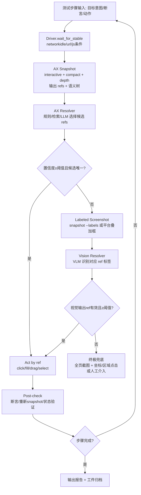

# 面向鲁棒元素定位的 UI 前端自动化测试平台技术方案可行性研究

## 执行摘要

基于用户提供的帖子《【分享】AI 自动化测试方案》，当前“AI + UI 自动化测试”主流路径可概括为两条：一条是以 DOM/语义树（可访问性树、AX tree）为核心的结构化定位与操作（如 agent-browser），另一条是以页面截图 + 视觉模型为核心的纯视觉操作（如 Midscene.js）；帖子也明确指出两者的典型取舍：DOM 路线成本低、速度快、易接入 CI/CD，但前提是页面结构相对稳定；纯视觉路线更适合结构不稳定或需要验证布局/样式的场景，但推理成本与不确定性更高。 citeturn2view0

围绕“更鲁棒的元素定位策略”，本报告给出一个可落地的自动化平台技术方案：以 **AX Tree / Accessibility Tree 优先**（结构化、可解释、低成本）为主路径，在定位置信度不足或执行失败时，采用 **截图回退**（最好是带 ref 标签的截图）做 disambiguation 或兜底，形成“**语义优先、视觉补强**”的混合策略。该策略与 OpenClaw 的 browser 工具设计高度一致：它提供确定性的 `snapshot → ref → act` 闭环，并支持 `--labels` 生成带 ref 叠加标注的截图用于调试与辅助定位；同时它在内部通过 Playwright 的 `aria-ref` 或 `getByRole(...)+nth()` 解析 ref，确保从观察到执行的映射可解释、可复现。 citeturn12view0turn11view3turn12view0

从工程可行性角度，agent-browser 与 OpenClaw 分别提供了两种实现“AX Tree 优先”的成熟基础设施：agent-browser 的 `snapshot` 输出紧凑的可访问性树并给每个元素分配 ref（`@e1/@e2`），强调低 token、确定性与多会话隔离；OpenClaw 的 browser 工具则围绕 `snapshot`（AI/ARIA/interactive 多模式）、`act`、`screenshot --ref/--labels`、trace、网络与错误采集构建了更完整的自动化与可观测能力。 citeturn13view0turn9view0turn12view0turn11view2turn12view2

本报告最终给出的平台方案包含：统一驱动层（agent-browser / OpenClaw / Playwright-on-CDP 适配器）、多策略定位引擎（AX Tree Resolver + Vision Resolver + 融合决策）、实验基准与遥测体系、CI/CD 集成与回滚机制、以及一套“ax-tree 优先、失败回退截图定位”的参考实现流程与伪代码。核心结论是：**混合策略在工程上可行且高性价比**，但其成功率强依赖应用的无障碍语义质量（角色/可访问名称/可交互性）与对动态渲染场景的同步策略；因此平台需同时投入 **a11y 质量门禁** 与 **回退策略的可观测/可解释闭环**。 citeturn18search0turn18search3turn12view0turn13view0

## 背景与需求细化

用户提供页面强调的痛点是：在 AI 生成或自愈脚本的场景下，“定位不到元素”会让大量用例变成废用例，造成 token 与时间成本浪费；并且 DOM/选择器与视觉识别各自存在天然短板。 citeturn2view0

从定位策略的“鲁棒性”角度，关键矛盾在于：前端页面在迭代中发生变化的类型很多，且对不同定位信号的破坏程度不同。典型变化包括：  
一类是 **样式/布局变化**（class 重命名、CSS 重构、主题切换、分辨率缩放），对基于 class/xpath 的定位杀伤力大，但对基于可访问语义（role/name）影响可能较小；另一类是 **结构变化与动态渲染**（React/Vue 组件重构、列表虚拟化、异步加载、DOM 节点重建），会让基于 DOM 路径的定位与缓存句柄失效；还有一类是 **语义变化**（按钮文案改动、可访问名称来源变化、aria-label 调整），则会直接影响基于可访问名称的策略（包括 `getByRole(name=...)`、aria snapshot 模板匹配）。 citeturn18search0turn19search0turn8view2

“AX Tree/Accessibility Tree 优先”的技术基础，是浏览器会为辅助技术（如屏幕阅读器）构建无障碍树：它是从 DOM 派生的语义化树，去除了大量纯装饰节点，节点带有 role 与 name 等语义信息；Chrome DevTools 也明确说明无障碍树是辅助技术交互网页内容的底层模型，且由 DOM 与 ARIA 属性塑造。 citeturn18search3  
另外，W3C《Accessible Name and Description Computation》规范定义了用户代理如何计算可访问对象的 name/description，并通过无障碍 API 暴露给辅助技术，这使得“可访问名称”成为可标准化依赖的定位信号。 citeturn18search0turn18search1

在工具层面，agent-browser 将这一抽象产品化为 “snapshot + refs” 工作流：`snapshot` 返回紧凑的可访问性树并为元素分配 ref，实现确定性选择与低 token 输出。 citeturn13view0turn9view0turn7view0  
OpenClaw 的 browser 工具也同样围绕 “快照与 ref” 构建：`snapshot` 可输出默认的 AI 快照（带数字 ref，基于 `aria-ref="<n>"`），也可输出交互式角色快照（`e12` 形式），操作命令只接受 ref，刻意避免脆弱的 CSS 选择器；同时支持 `--labels` 生成叠加 ref 标签的截图，便于调试与视觉辅助定位。 citeturn11view3turn12view0turn12view0turn12view0

与之对照，Midscene.js 在 README 中明确其路线：“纯视觉定位”，UI 动作的元素定位与交互基于截图完成，并支持多种视觉语言模型；这使其在 DOM/语义信息不足（如 `<canvas>`、无标签自定义控件）时具备优势，但在成本、稳定性、可解释性上需要更强的工程护栏。 citeturn5view3turn4search2

## 关键比较维度与指标体系

为保证平台选型与落地评审可量化，本报告建议将比较维度固化为“可测指标 + 采集口径”，并为每项维度定义推荐的度量方式。

准确率建议拆成三层：元素定位准确率（是否选中正确目标）、动作成功率（click/fill/drag 等是否被浏览器确认执行并引发预期 UI 状态变化）、端到端任务成功率（多步骤后业务目标是否达成）。WebArena 等基准强调以“功能正确性”评估复杂网页任务完成度，也提示单步匹配不足以代表真实效果。 citeturn20search1turn20search9

鲁棒性建议按变更类型分桶评估：对 DOM 变更（节点重建、层级重排）、对样式变动（class 变化、主题/缩放/分辨率）、对动态渲染（异步加载、动画、虚拟列表）分别做定量压力测试。Chrome 对无障碍树的描述表明其结构与角色/名称等语义通常更贴近用户感知而非样式细节，因此对“纯样式变更”有天然抗性，但对“语义变化”（name/role 改动）则敏感。 citeturn18search3turn19search0turn18search0

性能维度应同时衡量延迟与吞吐：单步定位耗时、单步动作耗时、整用例时长，以及在并发会话/并发用例下的吞吐与资源占用。agent-browser 的架构是 “Rust CLI + Node.js daemon（Playwright 浏览器实例）”，daemon 常驻可降低每次命令的启动开销；其官方文档也将“Fast/daemon persists”作为核心卖点。 citeturn13view0  
OpenClaw 的 browser 工具在内部通过 CDP 连接 Chromium，并在 CDP 之上使用 Playwright 处理高级操作；其文档明确了缺少 Playwright 时部分能力降级，这也意味着性能与能力可通过“是否启用 Playwright”做分级配置。 citeturn11view2turn11view2

实现复杂度与可维护性建议从“依赖面”和“调试闭环”两方面量化：依赖浏览器内核（Chromium-only vs 多引擎）、依赖外部模型（云端 VLM vs 本地 VLM）、以及对日志/trace/快照/截图等工件的采集成熟度。OpenClaw 文档给出了较完整的调试工作流（snapshot → highlight → errors/requests → trace），并明确提供 JSON 输出与统计块，利于平台做结构化遥测。 citeturn12view0turn12view1turn12view0

跨浏览器/跨平台适配需要区分两层：一是 OS/运行环境（Linux/Windows/macOS、CI 容器、无头/有头），二是浏览器引擎（Chromium、Firefox、WebKit、移动端 Safari 等）。agent-browser 的定位是跨平台 CLI，并提供 iOS Simulator / 真机 Safari 的能力入口（provider=ios）。 citeturn13view0turn15search1  
OpenClaw 的 browser 工具则以 Chrome/Brave/Edge/Chromium（均为 Chromium 系）为核心，并支持配置远程 CDP、Browserless 等托管 Chromium 端点。 citeturn5view1turn11view0turn11view2

安全与隐私影响必须纳入平台底座设计。OpenClaw 明确提示浏览器 profile 可能包含已登录会话，需视为敏感信息；并警告 `evaluate`/`wait --fn` 会在页面上下文执行任意 JS，存在被提示注入操纵的风险，可通过配置禁用。 citeturn12view1  
视觉方法天然涉及截图外传（若使用云模型），因此平台需提供脱敏、访问控制、密钥管理与可审计的媒体存储策略；相对而言，AX Tree 主要暴露文本与语义结构，仍可能包含 PII，但通常比全像素截图更易做字段级过滤（例如对输入框 value 做掩码）。

对无障碍 API 的依赖与兼容性需要明确：AX Tree 方法高度依赖浏览器/平台无障碍树质量；W3C accname 规范与 Chrome 对无障碍树的说明意味着“可访问名称/角色”是跨实现相对一致的基础，但现实中仍会遇到自定义控件无 role、aria-hidden 误用、或 name 不可预测等问题。 citeturn18search0turn18search3  
对视觉差异的敏感性则是纯视觉方法的核心挑战：分辨率、缩放、主题、语言、字体渲染差异都会改变像素；因此需要在基准集中显式覆盖这些维度，并在回退策略中加入“标准化渲染环境”（固定 viewport、DPR、主题）与“模型输出置信度阈值”。

失败回退策略与可解释性应当成为平台硬指标，而非“出错再看日志”。OpenClaw 明确给出当操作失败时的诊断顺序（snapshot、highlight、errors/requests、trace），并可生成带 ref 的 labeled screenshot；这些能力正适合被平台化为自动回退与自动取证的标准流程。 citeturn12view0turn12view1turn12view0

## 三类元素定位方法深度分析

### DOM 与辅助树优先策略

这类方法不是简单的 CSS/XPath，而是以“语义层”作为主要定位信号：role、可访问名称（name）、状态属性（checked/selected/expanded 等）、以及树的层级关系。Playwright 官方文档将 `page.getByRole()` 定位器定义为反映用户与辅助技术对页面的感知，并建议通常提供可访问名称以精确定位；这说明基于 role/name 的定位在自动化测试语义上更接近用户可感知契约。 citeturn19search0

在工程实现上，agent-browser 与 OpenClaw 都将该思路进一步“ref 化”：  
agent-browser 的 `snapshot` 返回可访问性树并分配 `@e1/@e2` 等 refs，用 ref 做确定性选择；其文档强调紧凑输出（约 200–400 tokens）与“ref points to exact element from snapshot”。 citeturn13view0turn7view0  
OpenClaw 的 `snapshot` 默认 AI 快照输出数字 ref，并通过 Playwright 的 `aria-ref` 解析；角色快照输出 `e12` 形式 ref，并通过 `getByRole(...)+nth()` 解析；操作命令刻意不支持 CSS selector，以避免脆弱性。 citeturn12view0turn11view3turn12view0

典型算法/实现要点可抽象为：先把页面观察结果规范化为“语义节点集合”，再对任务目标做匹配。无障碍树中的“可访问名称”并非随意字符串，而是由用户代理按标准算法从内容、label、aria-label、aria-labelledby 等组合推导；W3C accname 规范与 WAI APG 实践指南都强调浏览器实现了复杂但可标准化的 name/description 计算与优先级。 citeturn18search0turn18search1  
在底层采集上，Chrome DevTools Protocol 提供了 Accessibility 域（AXNode、queryAXTree 等）用于查询 DOM 节点的无障碍子树与可访问 name/role，这为“AX Tree 解析/过滤/增量更新”提供了协议层基础。 citeturn8view1

优势主要体现在可解释性与成本：输出紧凑、定位语义稳定、容易做审计。Chrome 对无障碍树的描述指出它源于 DOM 的派生与简化，移除无语义节点，强调角色与名称；这与“让定位更接近用户契约”的测试哲学一致。 citeturn18search3turn19search0

常见失败场景集中在“语义缺失/歧义”：  
其一是自定义控件未设置正确 role 或可访问名称，导致 `getByRole`/AX Tree 找不到或误匹配；其二是页面上存在多个同 role 同 name 的元素（如多个“提交”按钮），需要额外上下文（祖先容器、邻近文本、顺序 nth）；其三是 ref 的稳定性边界：OpenClaw 明确指出 ref 在导航之间不稳定，出错需要重新 snapshot 取得新 ref。 citeturn12view0turn12view0

可测评指标与测试用例设计建议：  
指标上，除定位 top-1 命中率外，还应记录候选集大小、歧义率（>1 候选）、以及通过“补充上下文（容器限定/正则 name/结构模板）”后歧义消解成功率。Playwright 的 aria snapshots 支持用 YAML 模板匹配可访问性树结构，并支持正则与部分匹配，这可被用来构造“结构契约测试”与“变更影响范围”评估。 citeturn8view2turn19search1  
用例上，需要覆盖：有良好 label 的表单、有大量装饰 div 的 SPA、含 shadow DOM 的组件（Playwright 定位器通常可穿透 shadow DOM）、以及无障碍语义不完善的遗留页面（验证回退机制）。 citeturn19search0turn18search3

### 纯视觉方法

纯视觉方法以截图为主观察信号，通过视觉模型或计算机视觉算法输出目标元素所在区域或交互坐标，然后由自动化执行层完成点击/输入/滚动等操作。用户提供页面推荐的 Midscene.js 明确定位为“纯视觉测试方案”，通过截图交给视觉大模型识别并返回操作指令；帖子也指出其 token 消耗高、成本更高且模型偶尔会出问题。 citeturn2view0  
Midscene.js 官方 README 进一步强调其“all-in on the pure-vision route”：UI 动作的元素定位与交互仅基于截图；并列举支持的视觉语言模型（Qwen3-VL、Doubao-1.6-vision、gemini-3-pro、UI-TARS等），同时说明在数据抽取/页面理解时可以选择性引入 DOM（用于理解而非动作定位）。 citeturn5view3turn4search2

典型算法/模型链路可以分三类：  
一类是传统 CV（模板匹配、特征点、OCR + 规则），适合按钮图标固定、文本稳定的场景；一类是检测/分割模型，将 UI 元素当作视觉对象；第三类是 VLM/多模态 Agent，将“理解 + 定位 + 规划”合并在推理中。Midscene 代表的是第三类：以 VLM 直接做 UI grounding 与动作规划。 citeturn5view3

优势在于对“语义缺失与非 DOM 表面”的覆盖：例如 `<canvas>`、图像化控件、或无障碍树不完整的页面。Midscene 明确宣称可跨 web/mobile/desktop 甚至 `<canvas>` surface 工作，这是纯视觉路线的重要卖点。 citeturn5view3  
但代价是“像素世界的不确定性”：分辨率、缩放、主题、字体抗锯齿、动画帧、遮挡（modal/tooltip）都会影响模型定位；因此需要强工程护栏：固定测试渲染环境、在模型输出中要求置信度/候选框、多轮确认（例如点击前先高亮/框选回显）。

常见失败场景包括：相似控件混淆（多个同款按钮）、小目标定位偏移、滚动导致坐标系变化、以及截图时机不对（动画中间帧）。此外，若执行层采用“坐标点击”，一旦布局轻微变化就可能点击到相邻元素；因此需要“执行后验证”（例如再次截图/再次语义读取得到确认状态）。用户提供页面也将视觉方案定位为“补充”，尤其适合检测布局错位、样式问题这类 DOM 看不出来的内容。 citeturn2view0

可测评指标与用例设计建议：  
指标除了成功率，还应纳入像素误差（预测框与真实框 IOU）、点击偏移分布、以及“视觉差异敏感性曲线”（同一用例在不同 viewport/DPR/主题下成功率与置信度变化）。用例需要覆盖主题切换、语言切换（文本长度变化）、响应式断点、以及包含动画/骨架屏/懒加载的页面。

### 混合策略

混合策略的核心目标是：把“语义树的确定性与可解释性”作为主干，把“视觉在语义不足时的覆盖能力”作为补强，同时避免纯视觉的高频调用。用户提供页面本身给出了朴素混合建议：“DOM 打底，视觉补充”。 citeturn2view0

在工具基础上，OpenClaw 已经具备非常贴合混合策略的数据通道：  
它既能产出带 ref 的 AI/角色快照，也能对 ref 做 element screenshot（`screenshot --ref`），并能通过 `snapshot --labels` 生成视口截图叠加 ref 标签；此外，其“智能体工具 + 控制工作原理”明确：`snapshot` 提供稳定 UI 树（AI 或 ARIA），`act` 用快照 ref 来操作，`screenshot` 捕获像素（整页或元素）。 citeturn11view3turn12view0turn12view2  
这意味着混合策略可以优先让模型/规则在文本快照中选 ref；当候选歧义或缺失时，再用“带 ref 标签的截图”让视觉模型从图上选 ref（而不是输出坐标），从而保持最终动作仍然是 ref 驱动的确定性执行。

agent-browser 也具备混合策略的关键前半段：`snapshot` 给出可访问性树与 refs，并支持截图与多会话隔离；其 README 与官方文档都强调 “snapshot returns accessibility tree with refs”。 citeturn9view0turn13view0turn7view0  
差异在于：OpenClaw 原生提供 `--labels / screenshot --ref` 等更强的“视觉辅助 ref 选择”能力；如果平台以 agent-browser 为主驱动，可考虑在平台侧实现“refs → bbox → 叠加标注”的 labeled screenshot 以补齐这一环（或直接在需要混合时切换到 OpenClaw 驱动）。

混合策略的关键工程挑战是“回退判定”和“同步时机”：OpenClaw 明确 ref 在导航间不稳定，失败需要重新 snapshot；并提供 wait 增强（URL 通配符、load state、JS 条件等）用于稳定页面状态后再获取快照。 citeturn12view0turn12view0turn12view0  
因此平台必须把 “等待与稳定性” 做成一等公民，而非散落在脚本里。

可测评指标与用例设计建议：  
混合策略除整体成功率外，需要重点衡量：视觉回退触发率（越低越省）、回退后增益（回退触发时成功率提升幅度）、以及“错误可解释性覆盖率”（失败是否能自动产出 snapshot/labels/trace/requests/errors 等工件）。OpenClaw 的 trace、errors、requests 与调试工作流可直接作为平台的自动取证管线。 citeturn12view1turn12view0turn12view0

## 混合策略落地方案：AX Tree 优先，失败回退截图

### 总体思路与可行性评估

“优先 AX Tree，失败再用截图定位”的可行性，取决于两个问题：  
第一，AX Tree 是否能提供足够的候选空间与可解释 ID；第二，截图回退能否将视觉识别结果稳定地映射回可执行的目标。

在 OpenClaw 体系中，这两个问题基本已被工具设计解决：  
其快照体系提供两类 ref（数字 ref 与角色 ref），并分别通过 `aria-ref` 或 `getByRole()+nth()` 解析；它还支持 `--labels` 输出叠加 ref 标签的截图，让视觉模型可以输出“ref 标签”而非“坐标”，从而仍然走 ref 驱动的确定性执行。 citeturn12view0turn11view3turn12view0  
这使得混合策略不仅可行，而且在工程上具备很强的可解释性：每一步都能说明“为什么选这个 ref、它在快照里的语义是什么、在截图上对应哪里”。

在 agent-browser 体系中，AX Tree 优先非常成熟：其文档明确 `snapshot` 返回可访问性树与 refs，强调低 token 与确定性；并且其 client-daemon 架构有利于高频“snapshot → act → snapshot”循环。 citeturn13view0  
但若要实现“截图回退稳定映射到 ref”，更建议：  
其一，平台侧生成 labeled screenshot（通过查询 refs 的 bbox 并叠加绘制）；其二，在混合场景直接调用 OpenClaw 的 `snapshot --labels`（以 OpenClaw 做视觉回退驱动）。两种路径都能落地，但第一个需要实现 bbox 批量获取与渲染，第二个引入双驱动切换的复杂度。

### 数据流与回退逻辑

下面给出推荐的数据流：以 OpenClaw 风格为基线（因为其原生支持 `--labels`），同时保持接口抽象，便于将来替换为 agent-browser 或 Playwright 直连实现。 citeturn12view0turn12view2



此流程的关键“判定点”主要有两处：  
一处是 AX Resolver 产出的候选是否足够确定；另一处是视觉回退输出是否可信。OpenClaw 的 JSON 输出包含快照统计块（lines/chars/refs/interactive），可用来估计候选空间密度与上下文复杂度，从而动态调整阈值或直接触发 labeled screenshot。 citeturn12view0

### 同步与异步策略

同步策略方面，强烈建议将 “页面稳定等待” 作为每次 snapshot 的前置条件，尤其是动态渲染页面。OpenClaw 提供了组合等待：URL、load state（如 networkidle）、JS 条件与选择器可见性，并允许组合使用；这些能力可直接作为平台 Driver 的统一接口。 citeturn12view0turn12view0

异步策略方面，一种高性价比优化是：当步骤复杂度较高或历史上经常触发回退时，可以 **并行** 启动两条轻量任务：  
其一是 AX snapshot；其二是本地截图采集（不立即发给模型），当 AX Resolver 置信度不足时立刻取用截图进行 labeled overlay 或直接送入 VLM，从而减少一次额外截图的等待时间。OpenClaw 的 `--labels` 本质上也可以看作把“截图采集 + overlay”集成到 snapshot 流程中。 citeturn12view0turn12view0

### 阈值、回退判定与性能优化

阈值设计建议采用“分层置信度”，而不是单一分数：  
第一层是语义匹配置信度（role/name/状态属性匹配程度）；第二层是上下文唯一性置信度（在限定作用域内是否唯一；是否需要 nth）；第三层是可执行性置信度（元素是否可见/可用；是否被遮挡）。agent-browser 与 OpenClaw 都提供 `wait --load networkidle` 等机制，以及“失败后重新 snapshot 获取新 ref”的运行范式，平台应把这个范式固化到执行器中。 citeturn7view0turn12view0turn12view0

性能优化上，建议优先使用“交互元素快照”而非全树，减少候选空间与解析成本。agent-browser 的 skill 文档建议 `snapshot -i --json`（只输出交互元素 + JSON），并在用例变化后重新 snapshot；这是低成本高吞吐的典型用法。 citeturn7view0  
OpenClaw 也提供 `--interactive`、`--compact`、`--depth` 与 `--efficient` 等预设以降低快照负载，并强调交互元素列表最适合驱动操作。 citeturn12view0turn11view3turn12view0

并发与资源消耗方面，建议将“浏览器会话”作为隔离单元：agent-browser 支持多 session 隔离（不同 auth）；OpenClaw 支持多个命名 browser profile（openclaw/work/remote）与 target（sandbox/host/node）路由。平台应在调度层限制并发会话数、为视觉模型调用做配额、并对 trace/截图等大工件做采样与 TTL。 citeturn7view0turn11view0turn12view2

### 参考伪代码

```pseudo
function run_step(step, driver, config):
  driver.wait_for_stable(step.stability_conditions)

  snap = driver.snapshot(mode="interactive", json=true, efficient=true)
  candidates = ax_resolve(step.intent, snap.refs, snap.snapshot_text)

  if candidates.best.score >= config.ax_threshold and candidates.best.is_unique:
      result = driver.act(ref=candidates.best.ref, action=step.action, value=step.value)
  else:
      labeled = driver.snapshot_labels(mode="interactive")  // 生成带ref标签截图
      vision_ref = vision_resolve_ref(step.intent, labeled.image)
      if vision_ref.score >= config.vision_threshold:
          result = driver.act(ref=vision_ref.ref, action=step.action, value=step.value)
      else:
          // ultimate fallback
          full_img = driver.screenshot(full_page=true)
          coord = vision_resolve_coord(step.intent, full_img)
          result = driver.click_xy(coord.x, coord.y)

  verify = post_check(step, driver)
  if not verify.ok:
      // resnapshot & retry once; ref may be unstable across navigation
      snap2 = driver.snapshot(mode="interactive", json=true)
      return retry_with_new_refs(step, snap2)

  return result
```

## 实验设计与基准集构建

### 基准集构建建议

为了评估“定位策略”而非“特定网站脚本技巧”，基准集需要覆盖页面多样性、动态性、无障碍语义覆盖率与视觉主题差异。

页面多样性建议包含：表单密集型（登录/注册/支付）、列表/表格密集型（管理后台）、内容型（资讯/论坛）、以及包含复杂组件（弹窗、drawer、toast、日期选择器、富文本编辑器、iframe）。WebArena 的设计思路是将复杂网站场景容器化以保证可复现，并提供长时序任务与功能正确性评估；这类可复现环境很适合作为你们的“回归基准集”来源或参考。 citeturn20search1turn20search9

动态性建议分档：静态页、轻量 SPA、重度 SPA（路由切换、骨架屏、懒加载、虚拟列表）。同时建议引入“变更扰动集”：对同一页面自动施加可控扰动，如 class 重命名、DOM 包裹层新增、文本微调、主题切换，以刻画鲁棒性曲线。

无障碍标签覆盖率建议作为显式分层因素：Chrome 的说明表明无障碍树可被 DOM/ARIA 塑造；而 W3C accname 规范说明 name 的来源与优先级复杂但可标准化。因此同一策略在“语义覆盖高 vs 低”的页面上表现可能截然不同，必须作为分层变量。 citeturn18search3turn18search0

视觉主题建议覆盖：light/dark、不同缩放（90/100/125/150%）、不同 viewport（移动端断点/桌面）、不同语言环境（中英切换导致文本长度变化）。OpenClaw 提供 `set media dark|light`、`set device`、`set viewport`、`set locale` 等能力，可以把这些视觉扰动作为自动化参数化测试维度。 citeturn12view0

### 评价指标

建议最少采纳以下四组指标：

成功类指标：单步定位命中率、单步动作成功率、端到端任务成功率。WebArena 论文强调端到端成功与人类基线差距巨大，意味着评估必须关注长链路的累计失败。 citeturn20search1

成本类指标：每步耗时、整用例耗时、视觉模型调用次数与 token/费用。agent-browser 将“紧凑输出减少 tokens”作为主卖点，可将“平均每步上下文负载（chars/tokens）”纳入指标。 citeturn13view0turn12view0

鲁棒性类指标：在各类扰动下成功率下降幅度（Δsuccess）、回退触发率（fallback rate）、以及回退收益（fallback uplift = 回退触发条件下混合策略成功率 - AX-only 成功率）。

可解释性与可观测性指标：失败时工件完整率（是否自动采集 snapshot、labels、trace、network、errors）、以及“定位决策可复现率”（是否能用当时快照与日志复盘为何选 ref）。

### 统计显著性检验方法

由于不同策略通常在同一批任务上对比，推荐使用“配对统计检验”，避免任务难度差异带来的偏差：

对成功率差异，可用 McNemar 检验（配对二元结果）或配对 bootstrap 置信区间；对耗时等偏态分布，可用 Wilcoxon signed-rank 或配对 bootstrap。WebArena 等研究场景也常以任务级成功率为核心度量，因此配对设计的检验方式更贴近实际对比。 citeturn20search1turn20search9

### 日志与遥测字段建议

平台需要采集结构化遥测，才能持续迭代阈值、回退判定与性能优化。建议字段包括：

运行上下文：run_id、test_id、step_id、url、browser/profile/provider、os、headless、viewport、DPR、locale、theme、network_condition、timestamp。

AX 快照字段：snapshot_mode（interactive/ai/aria）、refs_count、interactive_count、chars/lines（OpenClaw 提供 stats 块）、候选集大小、top1_score、是否唯一、是否使用 nth、是否发生 ref 更新（resnapshot）。 citeturn12view0turn12view2

视觉字段：是否触发视觉、使用的输入（labels/fullpage/element）、模型名、token 用量、推理时长、输出类型（ref/coord）、输出置信度。

执行与错误：action_type、target_ref、执行耗时、错误类型（not visible/covered/strict violation 等）、是否自动重试、重试次数。OpenClaw 的调试工作流列举了典型失败类型并提供 highlight/trace，有利于将错误分类标准化。 citeturn12view1turn12view0

工件索引：snapshot_text_path、labels_image_path、screenshot_path、trace_path、console/errors/requests dump 路径与大小、保留策略（TTL、采样率）。

## 工程化落地：自动化平台总体方案与运维

### 平台总体架构

建议的平台架构以“可替换驱动 + 可插拔定位器 + 强可观测”为核心。

驱动层（Driver Abstraction）建议统一成以下能力面：open(url)、wait(stability)、snapshot(mode)、act(ref, action)、screenshot(kind)、trace(start/stop)、network/console/errors 获取。OpenClaw 的 browser 工具映射已经非常接近这一抽象：`snapshot` 返回稳定 UI 树，`act` 使用 ref 点击/输入，`screenshot` 捕获像素，并支持 profile/target 路由。 citeturn12view2  
agent-browser 侧则通过 CLI 命令提供 open/snapshot/click/fill/screenshot/sessions 等能力，并强调快照 ref 工作流与会话隔离。 citeturn9view0turn13view0turn7view0

定位引擎层（Locator Engine）建议实现多策略：AX Resolver、Vision Resolver、以及融合决策器。AX Resolver 可先做规则/检索（role/name/上下文），再在歧义时引入 LLM；Vision Resolver 优先从 labeled screenshot 输出 ref，避免坐标点击的不稳定。OpenClaw 的 `--labels` 为此提供了“低耦合、高解释”的工程路径。 citeturn12view0turn12view0

执行与断言层建议同时支持：传统断言（特定元素状态/文本）与结构断言（aria snapshot 模板）。Playwright 的 aria snapshots 提供 YAML 结构模板匹配、支持部分匹配与正则，可用于回归结构检查与变更审阅。 citeturn8view2turn19search1

### 在 agent-browser 或类似框架中集成混合策略

集成路径建议分为两阶段：

第一阶段以“最小侵入”接入：平台以外部进程方式调用 agent-browser CLI（使用 `--json` 输出便于解析 refs），以 `snapshot -i` 作为主观察，以 ref 执行 click/fill；当 AX Resolver 不确定时，调用 OpenClaw 仅用于生成 labeled screenshot 并返回 ref（或平台侧实现 labeled overlay）。openclaw 的技能文档甚至明确建议在“需要确定性选择与性能关键”时使用 agent-browser，在“需要截图/PDF/视觉检查”时使用内置 browser 工具，这与阶段化集成思路一致。 citeturn7view0turn12view2

第二阶段做“单驱动闭环”：若你们最终选择 OpenClaw/browserclaw 作为统一驱动，则可以完全在 `snapshot (interactive) → labels → act` 闭环内完成混合策略；OpenClaw 文档已提供 ref 解析机制（aria-ref / getByRole+nth）与 labeled screenshot，并且其安全/隐私与远程控制能力也更系统。 citeturn12view0turn11view3turn12view1  
browserclaw 作为从 OpenClaw browser 模块抽离的独立库，也提供了 snapshot+refs 的编程接口示例，并强调 refs 通过 Playwright locator 解析（aria-ref/getByRole 模式），可作为你们内部封装 SDK 的参考。 citeturn17view1

### 迁移风险、回滚策略与监控报警

迁移风险主要来自三类：  
其一是应用自身无障碍语义不足导致 AX Tree 方法失败率高；其二是动态渲染导致 snapshot 时机不稳定；其三是安全与隐私（截图/会话/远程 CDP）治理不到位。OpenClaw 明确提示 profile 含已登录会话、远程 CDP 端点“功能强大需保护”、以及可禁用 evaluate 以降低提示注入风险，这些都应被平台安全基线吸收。 citeturn12view1turn11view0

回滚策略建议采用“双通道”：保留现有稳定的选择器脚本作为 baseline，在平台配置中为每条用例设置“策略开关”（AX-only / Hybrid / Vision-only / Baseline），并在 CI 中以灰度方式逐步扩大混合策略覆盖面。当回退率或失败率超过阈值时，自动降级到 baseline 或 AX-only，并保留工件用于诊断。

监控与报警指标建议至少包括：端到端成功率、步骤失败率、视觉回退触发率、视觉调用成本、P95/P99 延迟、浏览器会话崩溃率、以及“工件缺失率”。对于 OpenClaw，若出现 snapshot hang/timeout 等问题，平台应捕获并自动切换到降级路径或重启会话；其 GitHub issue 中也出现过 snapshot 超时导致 gateway 不稳定的案例，这提示平台需要对“长时间无响应”做硬超时与隔离。 citeturn16search1turn11view2

### 对 CI/CD 的影响

用户提供帖子认为 agent-browser 速度快、token 低，且“CI/CD 接进去顺滑”，这是其在自动化测试平台中作为默认驱动的现实优势。 citeturn2view0turn13view0  
同时，OpenClaw 支持 headless、远程 CDP、Browserless 等模式，可将“有浏览器的执行节点”与“控制平面”分离，适用于 CI 中缺少 GUI/浏览器依赖的环境。 citeturn11view0turn11view2  
平台在 CI/CD 中需要额外关注：浏览器依赖安装缓存、并发 worker 的资源隔离、以及对视觉模型调用的网络/密钥管理。

### 关键维度对比表

| 关键维度                    | DOM+AX Tree 优先                                             | 纯视觉（截图+视觉模型）                                      | 混合策略（AX Tree 优先 + 截图回退）                          |
| --------------------------- | ------------------------------------------------------------ | ------------------------------------------------------------ | ------------------------------------------------------------ |
| 准确率（交互元素）          | 高：语义明确时可确定性 ref 执行（snapshot+refs） citeturn13view0turn12view0 | 中：依赖模型理解与像素定位，易受歧义影响 citeturn2view0turn5view3 | 高：多数走 AX，歧义时用 labeled screenshot 选 ref，兼顾覆盖与确定性 citeturn12view0turn12view0 |
| 鲁棒性（样式/主题/缩放）    | 较高：依赖 role/name 而非 class；但 name 改动会影响 citeturn18search3turn18search0 | 较低到中：像素变化敏感，需要强标准化与模型鲁棒性 citeturn5view3 | 高：优先语义降低像素敏感性，回退仅在必要时触发               |
| 鲁棒性（DOM 重构/动态渲染） | 中：仍受语义变化与渲染时机影响；需 wait+resnapshot citeturn12view0turn12view0 | 中：不依赖 DOM，但受动画/帧时机/滚动影响 citeturn2view0turn5view3 | 高：通过 wait 规范化 + 双信号互证（AX 与视觉）降低单点失败 citeturn12view0turn12view1 |
| 性能（延迟/吞吐）           | 高：文本快照小，daemon 常驻；成本低 citeturn13view0turn7view0 | 低到中：频繁截图+模型推理耗时/耗费 citeturn2view0turn5view3 | 中到高：多数步骤不走视觉；可并行预取截图优化尾延迟           |
| 实现复杂度                  | 低到中：依赖浏览器/Playwright & AX Tree 解析 citeturn11view2turn8view1 | 中到高：模型接入、坐标系、视觉差异处理、成本控制 citeturn5view3 | 中：需要决策器与回退链路，但可利用 OpenClaw 现成能力降低复杂度 citeturn12view0turn12view2 |
| 跨浏览器/跨平台适配         | 平台层高（CLI 跨 OS），引擎层取决于驱动（agent-browser/Chromium + iOS Safari；OpenClaw/Chromium+CDP） citeturn13view0turn15search1turn11view0 | 理论上高，但不同引擎渲染差异会放大像素域不确定性 citeturn5view3 | 中到高：主路径与驱动一致；视觉回退需控制渲染环境             |
| 可维护性                    | 高：ref/role/name 可解释；可用 aria snapshot 做结构回归 citeturn8view2turn12view0 | 中：脚本更像“意图驱动”，但调试依赖截图与模型输出 citeturn5view3turn2view0 | 高：有明确回退与取证工件（labels/trace），更利于团队维护 citeturn12view0turn12view1 |
| 安全与隐私影响              | 中：快照仍可能含文本/PII，但更易字段级过滤                   | 高：截图外传风险更大，需脱敏与权限控制                       | 中：默认不传图，回退才传；并可优先本地 VLM/私有化            |
| 对无障碍 API 依赖与兼容性   | 高依赖：应用无障碍质量直接决定上限 citeturn18search3turn18search0 | 低依赖：可绕过 a11y 缺陷 citeturn5view3                   | 中：仍依赖 a11y 作为主路径，但能覆盖 a11y 缺陷区域           |
| 失败回退与可解释性          | 中：需要额外工件（截图/trace）提升排障                       | 中：可视化直观但难复现模型内部原因                           | 高：ref+labels+trace 形成可复现链路，OpenClaw 已提供标准调试流程 citeturn12view1turn12view0 |

## 结论

面向工程团队“可落地、可维护、可控成本”的目标，推荐的自动化平台路线是：以 agent-browser / OpenClaw 提供的 **AX Tree 快照 + refs** 作为默认定位与执行通道（低 token、确定性、适合 CI）；在定位歧义或执行失败时，优先采用 **带 ref 标签的截图** 让视觉模型输出 ref（而非坐标），再回到 ref 驱动执行，从而在提升覆盖面的同时保持可解释性与可复现性。上述方案与用户提供帖子提出的“DOM 打底、视觉补充”方向一致，并能充分复用 OpenClaw 对 `snapshot/ref/labels/trace` 的成熟实现与安全基线提示。 citeturn2view0turn12view0turn12view1turn13view0